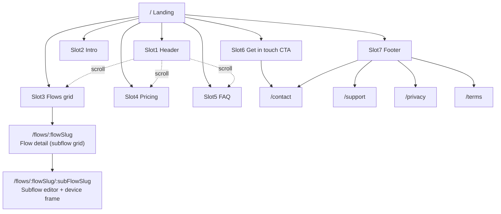

# 02 — Information Architecture

## Route table (`go_router`, path URLs)

| Route | Screen | Notes |
| --- | --- | --- |
| `/` | Landing page | Slots 1–7 in one scroll. Supports fragment scroll: `/#flows`, `/#pricing`, `/#faq` |
| `/flows/:flowSlug` | Flow detail | Grid of that flow's subflows. 404 → redirect to `/#flows` if slug unknown |
| `/flows/:flowSlug/:subFlowSlug` | Subflow editor | Left list + live device frame (Preview header) |
| `/contact` | Get in touch | Reached from Slot 6 CTA and footer "Contact" |
| `/support` | Support | Footer "Support" |
| `/privacy` | Privacy | Footer "Privacy" |
| `/terms` | Terms | Footer "Terms" |
| `*` | Not found | Redirects to `/` |

`flowSlug` and `subFlowSlug` values are the kebab-case slugs listed in
[`07-flow-catalogue.md`](07-flow-catalogue.md). Example: `/flows/content/drawing`.

External links (open in new tab):

- X / Twitter: `https://x.com/deveshmishra_09`
- Email: `mailto:devesh09269@gmail.com`
- Reference-only (not linked from prod UI, used while authoring copy):
  withanimation.app `/support`, `/privacy`, `/terms`

## Sitemap

## Navigation model

- **Header nav (Flows / Pricing / FAQ):** in-page smooth scroll when on `/`; otherwise
  `context.go('/')` then scroll to the fragment.
- **Flow card → flow detail:** `context.go('/flows/<slug>')`.
- **Subflow card / list item → editor:** `context.go('/flows/<flow>/<subflow>')`.
- **Editor left list:** switching items updates the last path segment (so every preview
  is deep-linkable and the browser back button works).
- **Footer product links:** scroll-to-slot on `/`, same fallback as header.
- **Back navigation:** browser back/forward works because every destination is a real route.

## Header/footer reuse

`SiteHeader` and `SiteFooter` are shared widgets used by: landing, flow detail, contact,
support, privacy, terms. The subflow editor uses `SiteHeader(variant: preview)` and no
footer (full-height workspace). See [`04-folder-structure.md`](04-folder-structure.md).
