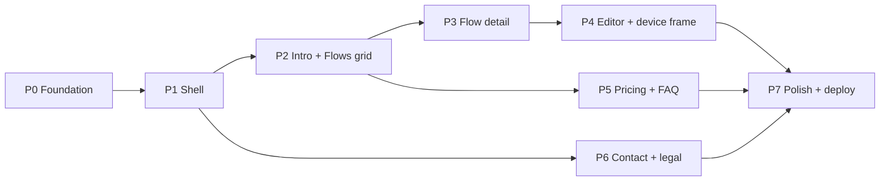

# 09 — Implementation Plan

Phased. Each phase ends with a verifiable check. `flutter analyze` clean and
`flutter test` green are gates for **every** phase.

**Progress:** Phase 0–7 ✅ (all 2026-09-10). Milestone build complete — see the
"Deferred" list below and `docs/10-deployment.md` for what remains before a public launch.

---

## Phase 0 — Foundation ✅

**Do:**
- Add deps: `go_router`, `url_launcher`, `shared_preferences`, `google_fonts` (R12/R13).
- `core/theme/**` — `AppColors` (`#af3a4a`), `AppTheme.light/.dark`, `AppText`,
  `AppSpacing`, `ThemeController` + `ThemeScope`.
- `core/constants/**` — `app_strings`, `app_links`, `breakpoints`.
- `core/models/**` + `core/data/flows_data.dart` (all 71 subflows, builders `null` for now
  except a couple to prove the shape), `faq_data`, `pricing_data` (TODO copy).
- `router/app_router.dart` with all 7 routes → temporary placeholder pages.
- Rewrite `main.dart` (`MaterialApp.router`, `usePathUrlStrategy()`, `ThemeScope`).
- Add `app.dart` (`EnterpriseUiPlaygroundApp`); fix `test/widget_test.dart`.
- Keep `lib/app_router.dart` untouched (legacy `AppRouter` is referenced by ~11 demo
  screens via the aggregator screens — deleting it would cascade into rewrites).

**Verify:**
- `flutter analyze` clean, `flutter test` green.
- `flutter run -d chrome` boots to `/`; manually visiting `/pricing`, `/flows/content`,
  `/flows/content/drawing`, `/contact` each renders its placeholder.
- Unit test: `kAllFlows` has 6 flows and 71 unique `flowSlug/subSlug` pairs; every
  `built` entry has a non-null builder.
- Theme toggle flips light/dark and the choice survives a reload.

## Phase 1 — Global shell (Slot 1 + Slot 7) ✅

**Do:** `SiteHeader` (defaultNav + preview variants, fixed, responsive menu),
`SiteFooter` (3 columns → stacked, copyright row), `PageScaffold`, `MaxWidthContainer`,
`ResponsiveLayout`, `ThemeToggleButton`, `AppLogo`. Wire footer/header links +
`url_launcher` for X. Section nav via `core/navigation/app_navigation.dart`
(`goToLandingSection` → `context.go('/', extra: LandingSection)`); the landing page
consumes `extra` and scrolls in Phase 2.

**Verify:** header sits above the scroll view in a Column so it is structurally fixed;
nav collapses to a `PopupMenuButton` < 1024; footer internal links `context.go`, external
open a new tab (`_blank`). Tests (`test/site_header_test.dart`, 4): desktop shows 3
`TextButton` nav links + no menu; phone shows menu + no nav links; preview variant shows
centered "Preview" + no nav; tapping "Pricing" routes to `/` with the section marker.
All 9 tests green; `flutter build web --release` OK.

**Deviations:** `mailto:` deferred to Phase 6 (it belongs to the Contact page, not the
shell). Router stub pages now render inside `PageScaffold` so the shell is exercised.

## Phase 2 — Landing Slots 2 & 3 grid ✅

**Do:** `IntroSection` (two-column on desktop → stacked on tablet/phone,
`HighlightedText` on *"for FlutterUI"*, reserved animation box). `FlowsSection`
("Explore the flows" + 1/2/3-col `GridView` from `kAllFlows`). `FlowCard`,
`SectionHeading`, `HighlightedText`. `LandingPage` owns a `ScrollController` + section
`GlobalKey`s and jumps via `Scrollable.ensureVisible` (no offset needed — the header is
outside the scroll view). Slots 4–6 are `_SlotPlaceholder`s so the Pricing/FAQ anchors
resolve. `goToLandingSection` now carries `SectionRequest = ({section, token})` so
re-tapping the same section re-scrolls.

**Verify:** tests (`test/landing_page_test.dart`, 4): eyebrow + `HighlightedText` present;
6 `FlowCard`s with titles + "24 subflows" for Content; tap "Content" → `/flows/content`
stub; headline font desktop > phone. `site_header_test` updated — "Pricing" from
`/contact` scrolls the section to `dy < 300`. All 13 tests green; web build OK.

**Deviations:** `LandingPage` reads `SectionRequest` as a widget field (router parses
`state.extra`), mirroring the old stub. **Router is no longer a global singleton** —
`createAppRouter()` per `MaterialApp.router` in `app.dart` (`StatefulWidget`, disposes
it); the global leaked navigation state between tests.

## Phase 3 — Flow detail (`/flows/:flowSlug`) ✅

**Do:** `FlowDetailPage` inside `PageScaffold` — centered `AppLogo` + flow title +
"N subflows" + 1/2/3-col `GridView` of `SubFlowCard`. `SubFlowCard` shows the title
(2-line ellipsis) + a Live/Soon status chip and routes to
`/flows/<flowSlug>/<subSlug>` regardless of status. Router `/flows/:flowSlug` builder
swapped from the stub to `FlowDetailPage`; unknown slug still `redirect`s to `/`.

**Verify:** tests (`test/flow_detail_test.dart`, 4): every flow renders `FlowDetailPage`
with `SubFlowCard` count == `flow.count` and the "N subflows" line; the 6 counts are
6/9/24/9/4/19; tapping "Logging In" → `Editor — Logging In`; `/flows/does-not-exist` →
`LandingPage`. All 17 tests green; web build OK.

**Deviations:** the flow `blurb` (all `TODO(copy)`) is kept in the model but not shown
on screen yet — "N subflows" stands in. Redirect target is `/` (no hash routing).

## Phase 4 — Subflow editor + device frame ✅

**Do:** `DeviceFramePreview` — a fixed 390×844 phone frame that runs the demo inside a
**nested `MaterialApp`** (own `Navigator`/`Overlay`/`Theme`; a `builder` re-wraps in a
phone-sized `MediaQuery`); scales down via `FittedBox(scaleDown)`, never up.
`SubflowEditorPage` (preview header, no footer): 20%-width `SubflowListPanel` rail
(clamp 180–320) + centered frame on wide, `_ChipStrip` + frame stacked below 900.
`ComingSoonScreen` (`Scaffold` with hourglass + "Coming soon" + "flow · subflow").
All **10 existing** screens wired in `flows_data.dart` via `import … show <Class>` (entry
points confirmed by opening each file — note `TransferringHomeScreen`, not the name doc 06
guessed). Router `/flows/:flowSlug/:subFlowSlug` builder → `SubflowEditorPage`; dead
`headerVariant`/`showFooter` params removed from `_StubPage`.

**Verify:** tests (`test/subflow_editor_test.dart`, 4): `/flows/account-management/logging-in`
mounts the real `LoginScreen` live under a **2nd `Navigator`** (isolation), with the rail,
no footer; a coming-soon subflow shows `ComingSoonScreen` + preview header; tapping
"Archiving" in the rail → URL `/flows/content/archiving` + preview swaps; at 600 px the
rail is gone and the chip strip lists titles. All 21 tests green; `flutter build web
--release` OK with all demos + `portal_labs` wired.

**Deviations:**
- **Nested `MaterialApp`** for isolation (doc 08's "simplest robust approach"), not a
  hand-rolled inherited-widget stack. Single device size, no `DeviceSpec` class (YAGNI).
- Several legacy demos (`login_screen.dart` etc.) have latent `Row`-without-`Flexible`
  overflows that show a debug stripe at phone width in the frame — pre-existing bugs in
  those files, **not fixed** (R17/R18). Editor tests that mount a real demo drain those
  layout errors; the rest of the editor tests use coming-soon subflows.
- "Bottom sheet stays in the frame" is structurally guaranteed by the nested Navigator
  but not asserted in a test (too brittle against demo internals).

## Phase 5 — Pricing (Slot 4) + FAQ (Slot 5) ✅

**Do:** `PricingSection` (centered "PRICING" eyebrow in primary, 3-line `h2` statement,
sub-line; `_PlanCards` = `IntrinsicHeight`+`Row` on desktop, `Column` below 1024).
`PricingCard` (`free` transparent/outlined + outlined CTA → scroll to flows; `plus`
`#af3a4a` bg / white fg + filled white CTA → `/contact`). `FaqSection` (`StatefulWidget`,
one `_openIndex`; centered `SectionHeading`, `Divider`-separated `FaqTile`s, max-width
720). `FaqTile` — `AnimatedRotation` chevron + `AnimatedCrossFade` answer.
`landing_page.dart`: the two `_SlotPlaceholder`s under `_pricingKey`/`_faqKey` swapped for
the real sections.

**Verify:** tests (`test/pricing_faq_test.dart`, 3): "PRICING" + 2 `PricingCard`s, Plus
card's `BoxDecoration.color == AppColors.primary`; `IntrinsicHeight` present at 1440 /
absent at 700 (stacking); FAQ has 5 tiles, opening one closes the previously open one
(`crossFadeState` assertions). `site_header` scroll test retargeted to the real "PRICING"
eyebrow. All 24 tests green; web build OK.

**Deviations:** placeholder pricing/FAQ copy was made **presentable** (not literal
`TODO(copy):` strings on screen) with a file-level `// TODO(copy)` marker kept for grep —
still per R4's intent, better for the in-progress review. Plus price shows `$—` /
"pricing soon".

## Phase 6 — Contact + legal pages

**Do:** `SocialCtaSection` (Slot 6 — centered `Wrap`: "Still have a question? " +
primary "Get in touch" `InkWell` → `/contact`). `InfoPageScaffold` — shared shell:
`PageScaffold` + dark hero band (`AppColors.inkBand`, R8) with centered `AppLogo`,
primary eyebrow, white `h1`, intro; then a `Divider` and a 720-wide body column.
`ContactPage` (eyebrow/heading/body from `AppStrings`; `_ContactRow` EMAIL/FOLLOW,
`spaceBetween` on ≥ tablet, stacked on phone; `mailto:`/X via `openExternalUrl`).
`SupportPage`/`PrivacyPage`/`TermsPage` reuse `InfoPageScaffold` + `ProseSections`
(`(heading, body)` pairs). Router `/contact` `/support` `/privacy` `/terms` builders →
real pages; `_StubPage` now only backs `errorBuilder`. `landing_page.dart`: last
`_SlotPlaceholder` → `SocialCtaSection`; the placeholder class removed.

**Verify:** tests (`test/info_pages_test.dart`, 6): Slot 6 CTA → `ContactPage`; contact
page shows hero ("CONTACT"), EMAIL + `devesh09269@gmail.com`, FOLLOW + `@deveshmishra_09`,
shared header + footer; `/support` `/privacy` `/terms` each render `InfoPageScaffold` +
footer + their eyebrow; contact rows present at phone width. All 30 tests green; web
build OK.

**Deviations:** support/privacy/terms carry **presentable draft copy** with a file-level
`// TODO(copy)` marker + inline "Last updated: TODO" (per R4, same call as Phase 5).
Info-page body is a centered 720-wide column rather than a literal 40–50 px gutter.
`mailto:`/X open is not asserted (needs platform-channel mocking); the tap targets are.

## Phase 7 — Responsive polish + deploy config ✅

**Do:** `test/responsive_smoke_test.dart` — 7 own-widget routes × {360×800, 768×1024,
1440×1000} × {light, dark}, asserting no overflow/exception per combination (built-demo
editor routes excluded — legacy overflow, Phase 4). Deploy config: `web/_redirects`
(bundled by the build; Netlify + Cloudflare Pages), `firebase.json` (SPA rewrite + cache
headers). Web metadata: `web/index.html` title / description / `theme-color #af3a4a` / OG
tags; `web/manifest.json` name / short_name / colors. `.github/workflows/web.yml` —
`pub get` → `flutter analyze --no-fatal-warnings` (legacy `lib/flows/**` has pre-existing
lint warnings; fail only on errors) → `flutter test` → `flutter build web --release`.

**Verify:** smoke test green (no responsive/dark overflow in our code); strict
`flutter analyze` on `lib/core lib/features lib/router lib/app.dart lib/main.dart test`
clean; all **32 tests** green; `flutter build web --release` OK with `_redirects` bundled
and the new `<title>`/`theme-color` in `build/web/index.html`.

**Deferred (need a real environment / decision):**
- Host choice (R14) → then wire the deploy step in `web.yml` and confirm a deep-link hard
  refresh (`/flows/content/drawing`) via the host rewrite.
- Lighthouse / real-browser visual + contrast pass.
- Replace every `TODO(copy)` (pricing amounts, FAQ, support/privacy/terms, flow blurbs),
  add the real logo (`assets/images/logo.svg`), the Slot 2 animation (R11/R15/R16).
- The ~61 unbuilt subflow demos; fixing latent `Row` overflows in the ~10 legacy demos.

---

## Sequencing diagram

P5 and P6 only depend on the shell (P1) + landing scaffold (P2) and can be done in
parallel with P3/P4 if needed.

## Rough size estimate

| Phase | New files | Notes |
| --- | --- | --- |
| P0 | ~18 | mostly small token/model files |
| P1 | ~7 | header/footer are the bulk |
| P2 | ~4 | |
| P3 | ~2 | |
| P4 | ~4 | device frame is the risk area |
| P5 | ~5 | |
| P6 | ~6 | 4 pages + section + shared legal layout |
| P7 | 0–2 | config only |
